# EventProf Search

## About this site

The purpose of the EventProf Search site is for Freelancers in the Events Industry to find open Event Projects and for Project Owners, to find suitable Freelancers.

Users can contact each other as required via email message from within the site if they would like to discuss a role further.

You can view the live site [here](https://eventprof-search.herokuapp.com/).

 

___

## Contents
## User Experience (UX)
- [User Stories](#user-stories)   
- [Design](#design)
- [Typography](#typography)
- [Imagery](#imagery)
- [Colour](#colour)
- [Wireframes](#wireframes)
- [Data Schema](#data-schema)
## Features
- [Sitewide](#sitewide)
- [Homepage](#homepage)
- [Freelancer listing page](#freelancer-listing-page)
- [Project Pages](#project-pages)
- [Admin Controls](#admin-controls)
- [Security](#security)
- [Error Handling](#error-handling)
- [Features to add in Future Releases](#features-to-add-in-future-releases)   
## Technologies & Tools Used
- [Frontend Frameworks](#frontend-languages-&-frameworks)
- [Backend Frameworks](#backend-tools-languages--frameworks)
- [Other](#other)
## Testing
- [Code Validation](#code-validation)
- [User Story Testing](#user-story-testing)   
    - [Event Freelancer](#event-freelancer)
    - [Event Project Owner & Event Recruiter](#event-project-owner--event-recruiter)
    - [Site Admin](#site-admin)
- For Lighthouse, Devices, Browser, Accessibility, Error Handling and Bugs testing - see [further testing documentation](./documentation/Testing.md)
## Deployment
- [Deploying to Heroku](#deploying-to-heroku)
- [Forking a GitHub Repo](#forking-a-github-repo)
## Credits

___

## User Experience (UX)
As the site needs to encourage user interaction and enagagement, it is important that the first user impression emits a positive 
emotional response. With the choice of softer colours, rounder edges, simplistic UI and fast load speeds, EventProf Search 
intends to do just that. 

In designing the application, the user stories, colour scheme, typography, tone have all been considered to contribute to this positive emotion and 
encourage repeat interaction. 

The data schema and how this data is collected, edited and displayed back to the user has also played an important role in the User Experience design, as noted below.

### User Stories
- Event Freelancer
    - As an Event Freelancer, I want to be able find suitable event projects that are looking for my skillset.
    - I want to be able to search the listings for projects openings at a specific location, or with keywords specific to my requirements i.e 'Producer'.
    - When I have found a suitable project, I want to be able to contact the owner of that project to inform them of my interest.
    - As the site allows for personalised profiles, I want the ability to update this information if necessary and publicly show this information to other users.

- Event Project Owner
    - As a Project Owner, I want to quickly find suitable Freelancers that could fill the position I have available.
    - I want the ability to check if Freelancers have the necessary skills for my project, without needing to read each profile bio.
    - If a suitable Freelancer is found, I want to be able to contact them easily to request more information from them. 
    - As a Project Owner, I want the ability to add further projects to the website, and edit those previously created.

- Event Recruiter
    - As a recruiter, I want to be able to find suitable candidates for contract projects based on a set list of skills and criteria. 
    - Since my knowledge of the specific project or role will be limited, I need to be able to quickly shortlist users based on easily identifiable skills.

- Site Admin
    - As a Site Admin, I want to be able to hide visibility of users on the freelancer listing page, if requested.
    - I want to have the ability to create new Skills and Roles for users to select when creating their profiles. 

### Design
The site design is simplistic in nature. To keep the user engaged, the UI is clean and not overly busy or complex, ensuring that the bold colour and call-to-action areas are easy to read and identify. 

EventProf Search uses a contemporary design with regards to UI buttons, cards, backgrounds and the colour scheme, which users expect with modern day sites focusing on social interaction.

#### Typography
The sans-serif font 'Lexend' has been selected for this site, as it helps to contribute to the clean, contemporary feel of the site, with sharp, easy to read characters. The font can be found at Google Fonts [here](https://fonts.google.com/specimen/Lexend).

#### Imagery
Similarly to the typography, the imagery used on this site is minimilistic, with only a single background image on the homepage, and then used throughout the page headers for continuity. 

Since the majority of the imagery will be user generated, site imagery is not required to improve the user experience. Instead the background chosed compliments the colour scheme of the site and ensure consistency between pages.

#### Colour
A vibrant, but slightly pastelled colour scheme has been selected for EventProf Search. Users are familiar with blue colour patterns from other popular social-based sites such as Facebook, Twitter and LinkedIn. As [CoSchedule](https://coschedule.com/blog/color-psychology-marketing#primary) suggest, blue is often associated with 'trust' or 'dependability'.

To compliment the blue shades, a brighter Teal and Pink colour have been used to help accent various features on the site and help them stand out, for example, under headers, the navbar, or call-to-action buttons.

 

### Wireframes
The wireframes for the initial site design can be found below. For the most part, the site reflects the wireframes 
as initially drawn, with a few minor styling and element positioning adjustments required during the build, as 
UI responsiveness was tested. For example, the location of buttons and layout of card contents needed to be adjusted 
slightly based on the data available.

Wireframe links:
- [View the Desktop wireframes here](documentation/wireframes/MS3_Wireframes_desktop.pdf)
- [View the Tablet wireframes here](documentation/wireframes/MS3_Wireframes_tablet.pdf)
- [View the Mobile wireframes here](documentation/wireframes/MS3_Wireframes_mobile.pdf)

 

### Data Schema
MongoDB is utilised to store data for EventProf Search. As a document based database versus table based, it 
enables the site to store individual, non-relational records that can easily be added, updated and deleted via 
frontend driven CRUD operations.

In designing the data schema, it was important to capture all data for each document that would be required for 
users to view pages, or edit or delete records. There are a number of fields that were also added to improve 
user experience or functionality. 

Whilst the data set for the most part can be handled independently from each other within the Flask app, with 
the nature of the site centered around user profiles and interaction, it was necessary to create a relationship 
between a minority of fields.

An outline of the data schema can be found below:

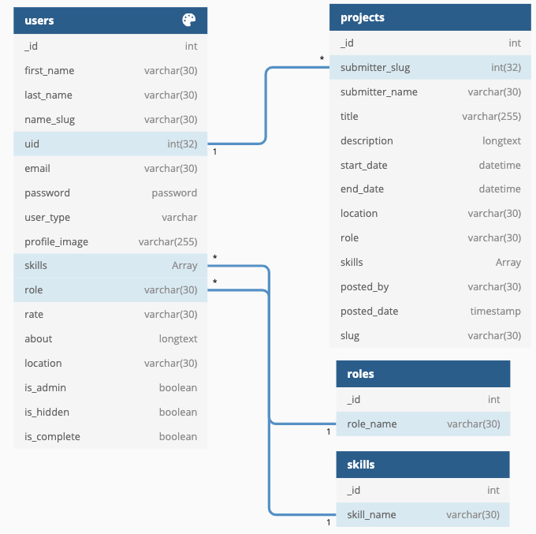

- #### Users table collection
    - Basic profile fields such as name, email, role, skills, rate, about, location.
    - Profile attributes such as 'is_admin', 'is_hidden' and 'is_complete' are used for visibility controls 
    to certain pages. For example, once a user first registered, they must complete their profile for this to be visible to other users. The 'is_hidden' field can be used on the admin dashboard to toggle a user's profile to 'hidden' and hide the profile from other users.
    - The 'name_slug' is used as the profile page slug when viewing a profile.
    - Now that the 'name_slug' can be updated when a user updates their name, the 'uid' is used to create the 
    email send function, and to populate the 'submitter_slug' if a user submits a new project (allowing another user 
    to email them). The UID is randomly generated upon registration to prevent users from guessing another user's UID (user 1, 2, 3 etc). 
    This ensures that the user profile remains consistent for application functions irrespective of user updates.

- #### Projects table collection
    - Similarly to the Users table, the project table includes basic project details such as title, description, start & end date, location, role, skills (posted as an array) and posted date.
    - These fields are used to pass the information back to the user at the frontend.
    - Additional fields are used for function operation, such as submitter_slug and slug, which identifies the user who submitted (and which email to send a message to), and the project slug to show in the URL.

- #### Skill / Role table collection
    - These tables exist to ensure that when users select skills or roles from the 'edit profile' or 'add project' pages, they are able to select them from a predetermined dropdown. 
    - By preventing users from free-typing into these fields ensures that the search indexing can be more accurate in finding similar results.
    - Adding the skills / roles to a table also enables Admins to add / delete these from the Admin dashboard, without a need to update the input options within the HTML.

- #### Session
    - The session data is not included within the MongoDB collection but is created by the Flask app module and stored in the browser. 
    Since it has a relationship with a few of the key User fields, it has been included within the data schema as a data store.
    - If the user is registered, the 'u_type', 'is_admin', 'uid' and 'slug' are pulled from the database if the email entered can be found. This information is then stored within the browser session until the user logs out.
    - If a new user registers, the session key values are generated based on the user input on the registration form. This data is then stored in the browser session until the user logs out.

 

---
 

## Features
### Sitewide
- User login and account creation.
- User profile type selection - freelancer or employer.
- User profile image (via URL) and information can be added and updated.
- Employer user type can add a project directly from the navbar.
- Project owners can see latest freelancers on their own profile via the sidebar widget. 
- Sidebar widget on freelancer / project page shows alternative recommendations based on 'role' of the current listing.

### Homepage
- Freelancer search functionality prominent on homepage.
- Latest projects are shown at the end of the page, prompting users to click-through.

### Freelancer listing page
- All freelancers that have completed profile information are shown in the listing.
- Users can search for freelancers based on location, name, skills or bio.
- Users can click to view more about the freelancer, or send an email.

### Project pages
- Projects can be searched using the search function at the top of the page.
- Projects show the location, type, dates and skills the project owner is looking for.
- All projects have individual page that can be viewed by clicking 'view more'.
- Project owners can add, edit or delete existing submissions by navigating to the project page.
- Freelancers can send project owners an email by clicking 'Email Project Owner' on the project page.

### Admin controls
- Admin users can switch user visibility on or off in the admin control (this hides the user from the freelancer page). 
- Admin users can add or delete roles or skills in the admin control.

### Security

Whilst hashed user passwords has been implemented from the outset as part of the Flask - Werkzeug module, it is also important that user emails and data remain secure. 

To secure backend environment variables such as passwords and 'secret keys', all such variables are stored in an env.py file locally, which is included within .gitignore to ensure they are not accessible within the public domain. The environment variables are then stored within the Heroku deployed application under the 'config vars' dropdown under 'settings'. 

- **User authentication**
    - Upon visiting the site, users are prompted to register or login. A 'session' is required to be generated to view the majority of the site. Having this in place ensures that users are who they say they are and can access and edit their own projects or profiles.
    - Sessions are created when a user successfully enters an email and password in the login form. This also then adds their User ID from the database to ensure they remain unique. 
    - If a user enters the wrong combination of email or password, or tries to register with an existing user email, they are redirected to the login page and no further access is granted. 

- **Authorisation**
    - Once users are logged in, visibility can be restricted further. For example if a user amends the URL in an attempt to edit another user's profile or project, a flash message is shown indicated that they do not have permissions, and the page is redirected to the 'freelancers' page, as shown below.
    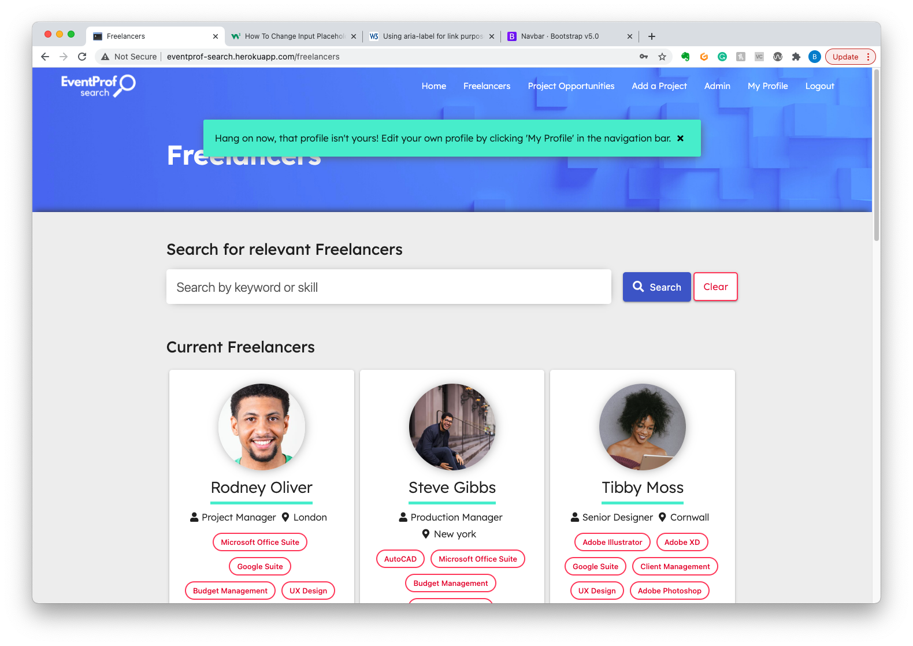
    - If instead a user attempts to view an admin page, to avoid the user being made aware that their is a page at the URL they are attempting to access, they are instead redirected to a 404 page.    

- **User Emails**
    - To avoid the requirement for users to display their emails to other users without their initial permission, the email flow within the 'send_email' function has been implemented using the Flask-mail module.
    - Using this approach, allows the user to use the form on the frontend to determine who the email should be sent to, but uses the 'send_email' function in 'app.py' to retrieve the email in the backend, versus storing the email within a hidden field in the form, as this would be accessible to the user if they inspect the DOM.

### Error Handling
To ensure that errors, both client-side and server-side are handled gracefully for the user, a custom 404 and 500 error page will be rendered if necessary. The Flask .errorhandler() method will detect the error in the production application and render the template as appropriate.

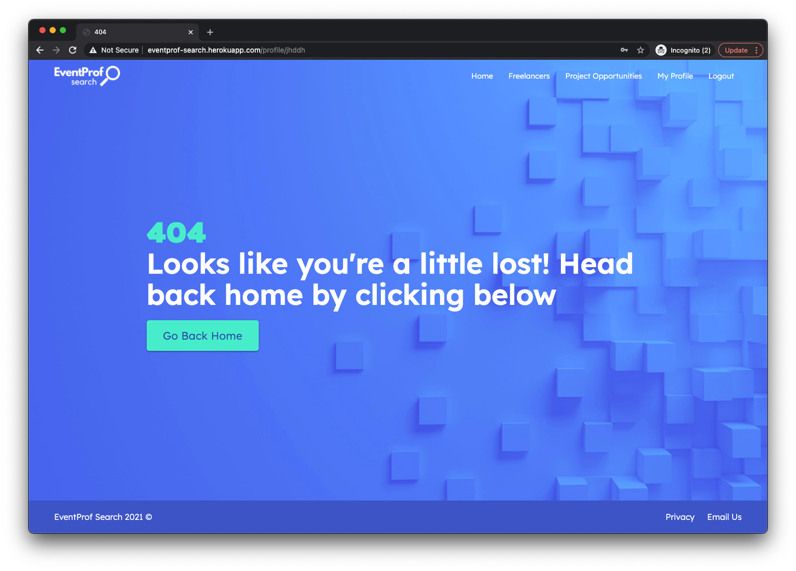

 

### Features to add in future releases
- LinkedIn integration to pull API data into profile.
- Realtime chat between users using either Ajax or Web Socket.
- Social sharing of projects. 
- User connections, allowing users to 'refer a friend' for projects.

 

---

## Technologies Used

### Frontend languages & frameworks
- [HTML5](https://dev.w3.org/html5/spec-LC/) - vanilla HTML for templates.
- [Javascript](https://www.javascript.com/) - minimal vanilla Javascript alongside JQuery to allow for modals, input manipulation and validation. 
- [Jquery](https://jquery.com/)
- [CSS](https://www.w3.org/Style/CSS/specs.en.html)
- [Materialize](https://materializecss.com/) - primary CSS & JS library for inputs and modals.
- [FontAwesome](https://fontawesom.com/) - used for freelancer and project card icons.
- [Bootstrap](https://getbootstrap.com/docs/5.0/) - minimal as required where Materialize classes insufficient.

### Backend tools, languages & frameworks
- [Python](https://www.python.org/) - primary backend language.
- [Flask](https://flask.palletsprojects.com/en/1.1.x/) - used in conjunction with PyMongo and Flask-mail to create connection with database and mail server.
- [Jinja2](https://jinja.palletsprojects.com/en/2.11.x/) - used for frontend templating using Flask connection.
- [MongoDB](https://www.mongodb.com/2) - non-relational database used to store user and project data.
- [Cloudinary](https://cloudinary.com/) - media storage for demo user profile images.
- [DBdiagram.io](https://DBdiagram.io) - for database design and modelling.
- [GitHub](https://github.com) - for version control and codebase storage.
- [GitPod](https://gitpod.oi) - Online cloud IDE for code editing and version commits.
- [Heroku](https://heroku.com) - Used for deployment of production application.

### Other
- [Name Generator](https://www.name-generator.org.uk/quick/) - for generating randomised names for demo users.
- [Colour Hexa](https://colorhexa.com) - for generating colour schemes and patterns.
- [AMI Responsive](http://ami.responsivedesign.is/) - used to generate device images and test responsiveness of application.

---

## Testing

For further details on device, browser, accessibility testing and error handling, go to the full testing documentation [here](documentation/Testing.md)

### Code Validation
The EventProf Search codebase has been checked through W3 HTML, Jigsaw CSS, JShint and PEP8Online validation services to eliminate or mitigate any errors.

You can find the results of each validation test below: 

#### W3C Jigsaw CSS
As with most builds, the majority of the errors returned in this validation are from third party libraries, in this 
case, font-awesome and Materialize. 

Whilst no errors were found in the style.css file, one error is produced from the third party Materialize. Within the style.css, there are a number of warnings relating to buttons and inputs having the same border and background colour. 
This is a stylistic decision, to ensure that on a button hover, the border is not then added, causing the button position to shift by 1px in each direction. 

In addition, the validator calls out various 'unknown vendor extensions' where browser specific attribute values are shown, e.g -webkit-fill-available. 
Whilst these values are recognised in the browsers, the validator does return these as errors.

See below an example of the W3C Jigsaw results and [the link here](https://jigsaw.w3.org/css-validator/validator?uri=http%3A%2F%2Feventprof-search.herokuapp.com%2Ffreelancers&profile=css3svg&usermedium=all&warning=1&vextwarning=&lang=en):

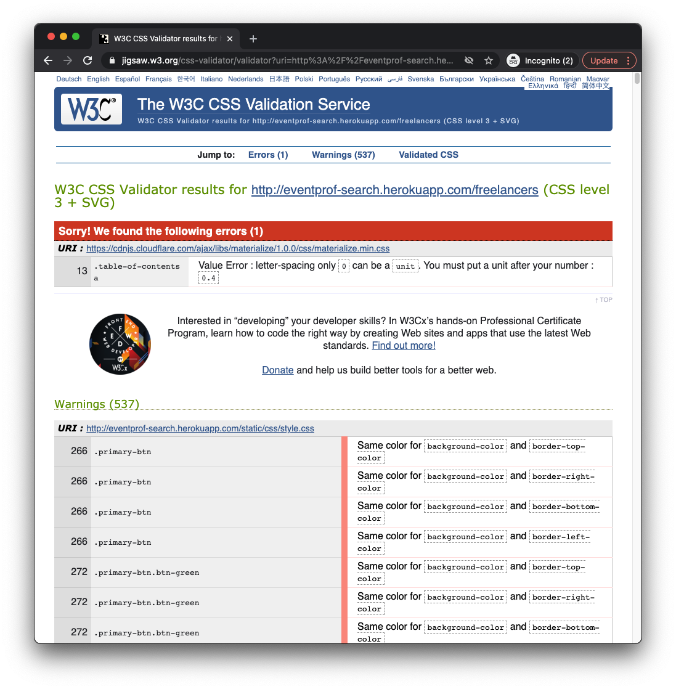

#### W3 HTML Validator
Every effort has been made to eliminate HTML errors across all pages. As the W3 Validator does not recognise Jinja2 templating as valid HTML, when the codebase was copied across for validation, many of the errors upon validation were a result of the Jinja syntax.

To avoid providing false errors, a further validation was made on each page by using the source code of the rendered DOM to ensure that all errors were caught.

One error remains on the 'Edit Project' and 'Edit Profile' pages, whereby due to Jinja2 logic not recognised by the validator, it believes there is more than 
one option selected under a single select dropdown input. This dropdown is however wrapped in Jinja2 logic, ensuring that only one of the inputs render for the user, depending on their user type.

An example of this error can be seen below:

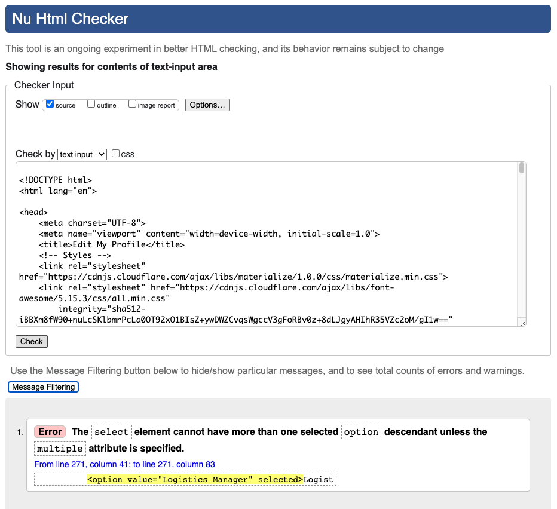

#### JSHint Results
The script.js file in the EventProf Search app is lightweight, initialising predominantly the Materialize functions and functions for improved styling. The file passes the JSHint validation with the expected, common warnings; 
- Warnings that the 'let' is available in ES6
- Missing variables created by jQuery '$' selector or function parameters. 

You can see an example of the warnings below: 

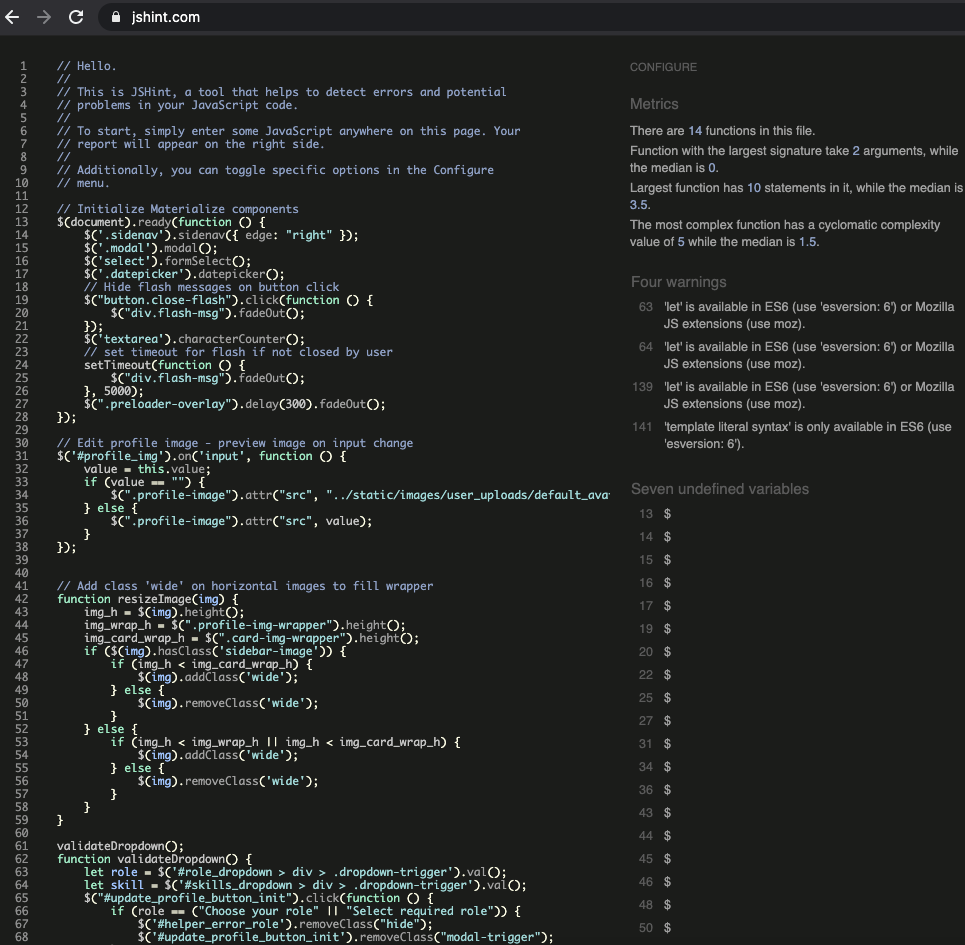

#### PEP8Online Results
The EventProf Search Python codebase successfully runs through the PEP8 validator without any issue, as shown by the results below:

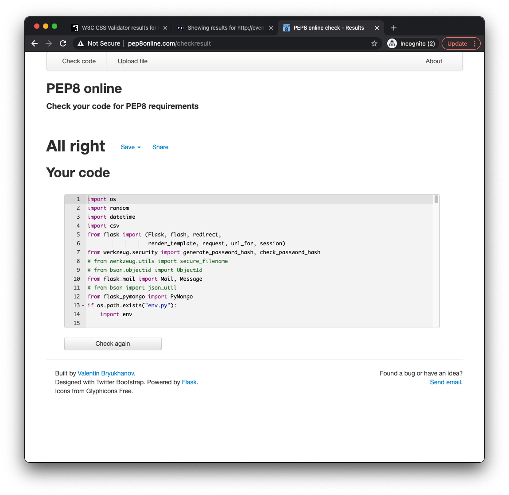

### User Story Testing
The site has been tested against the initial user stories to ensure that it meets the minimum requirements of its users. Details of how the site fulfills these tests are outlined below:

#### Event Freelancer
- As an Event Freelancer, I want to be able find suitable event projects that are looking for my skillset.
    - Freelancers can view the skillset required for projects both on the project card and under the header on the 'view project' page.
    
    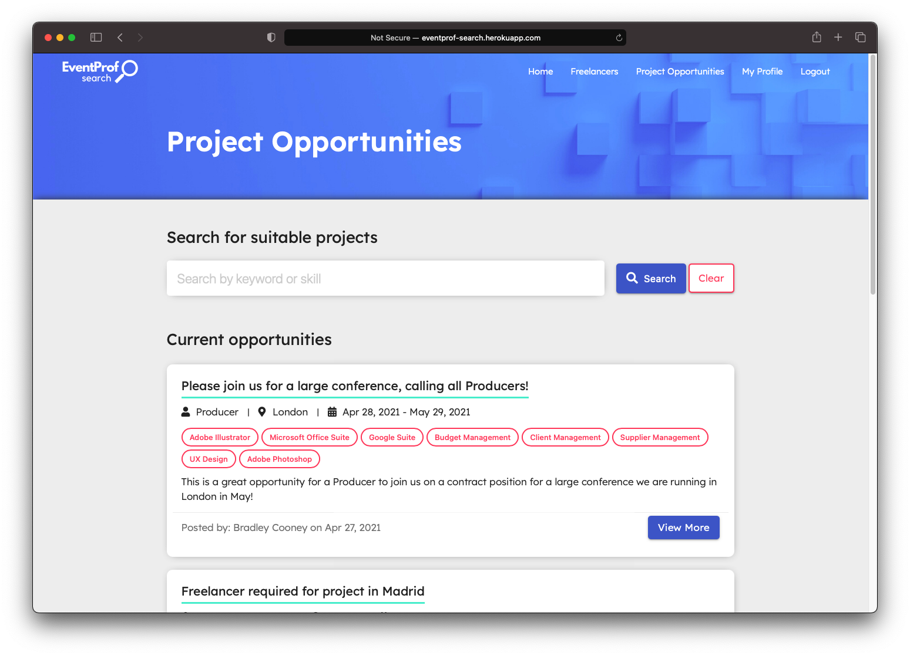
- I want to be able to search the listings for projects openings at a specific location, or with keywords specific to my requirements i.e 'Producer'.
    - Freelancers can use the searchbar at the top of the project listing page to search for their specific requirements.
    - If the search returns no results, then users can click the call-to-action button or 'clear' at the searchbar to view all projects.

    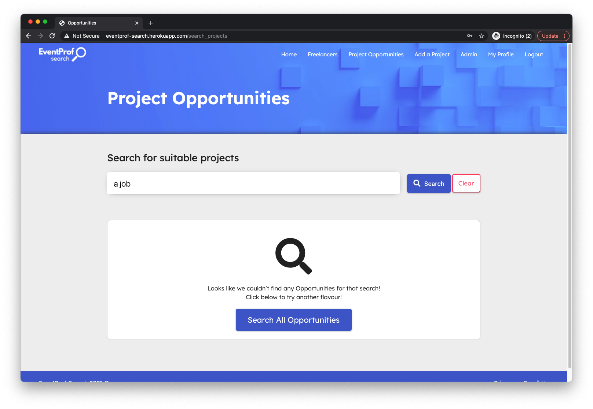
- When I have found a suitable project, I want to be able to contact the owner of that project to inform them of my interest.
    - Users can send an email to the project owner when viewing the project page, by clicking the 'Email Project Owner' button. 
    - When this CTA button is clicked, a modal popup will appear prompting the user to input the message. 
    - The user has the opportunity to change their email in the 'Your Email' input field.
    - To send the message, the user must agree to provide their email to the recipient.

    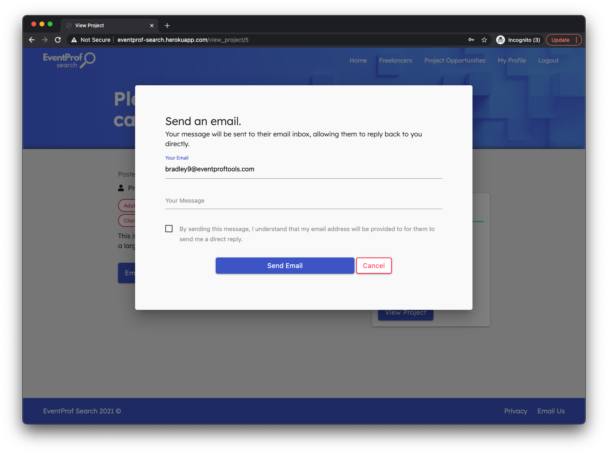    
- As the site allows for personalised profiles, I want the ability to update this information if necessary and publicly show this information to other users.
    - Users must complete their profile upon initial registration before it will be shown to other users.
    - Once created, users can update their name, rate, location, role, skills and bio in the 'edit profile' page.
    - All freelancers, unless hidden by an Admin, will be visible to other users.
    
    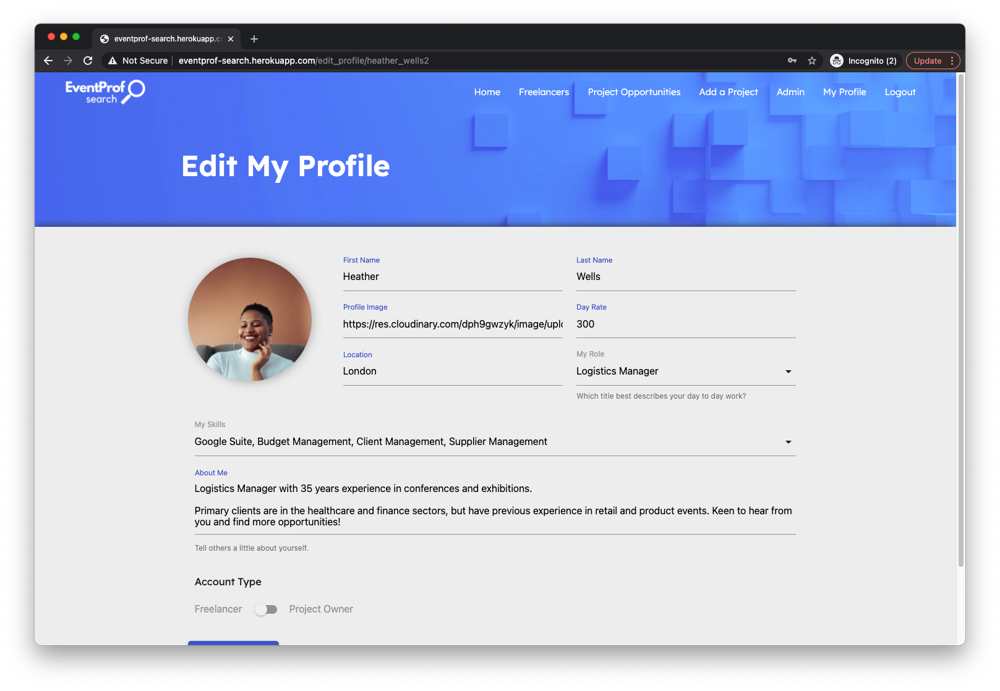

#### Event Project Owner & Event Recruiter
- As a Project Owner, I want to quickly find suitable Freelancers that could fill the position I have available.
    - Project owners can search for freelancers by name, location, skills or bio, on the 'freelancers' page.
    - If the search returns matching results, these users will be shown on the page, otherwise a 'no results' card is returned prompting the user to try another search.
    - If the user is currently on a 'Project View' page, then the sidebar widget will show up to three freelancers where the 'freelancer role' and the 'project role' are matched. 
- I want the ability to check if Freelancers have the necessary skills for my project, without needing to read each profile bio.
    - Users can quickly identify a freelancer's key skills by looking at the skill tags on each profile card on the 'freelancers' page.
    - The above functionality also satisfies the event recruiter's need to identify skills against a prepared set of criteria.

    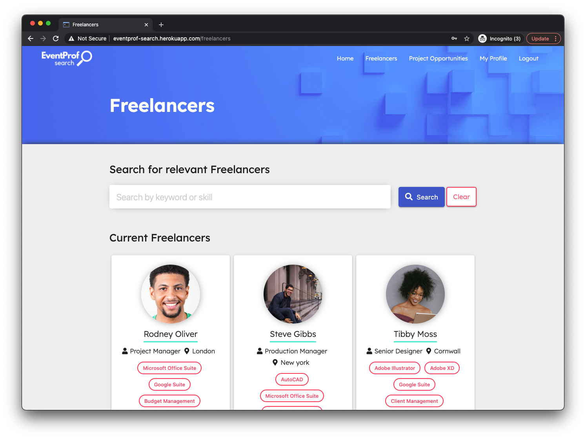
- If a suitable Freelancer is found, I want to be able to contact them easily to request more information from them. 
    - Users can send an email to freelancers directly from the 'freelancers' listing page, but clicking the 'send email' button on the profile card.
    - Upon clicking this CTA button, a modal form will appear, prompting the user to enter their message, and confirm they agree to provide their email to the recipient.
- As a Project Owner, I want the ability to add further projects to the website, and edit those previously created.
    - A user with the user type 'employer' will be able to add projects using the 'Add Project' link in the navbar.
    - Clicking this link will open the 'add project' form page, where users can input the key details before submitting.
    - Form validation is in place on this form to ensure users are entering sufficient and appropriate data, e.g only alphanumeric characters in text fields and minimum of 5 characters in length. 
    
    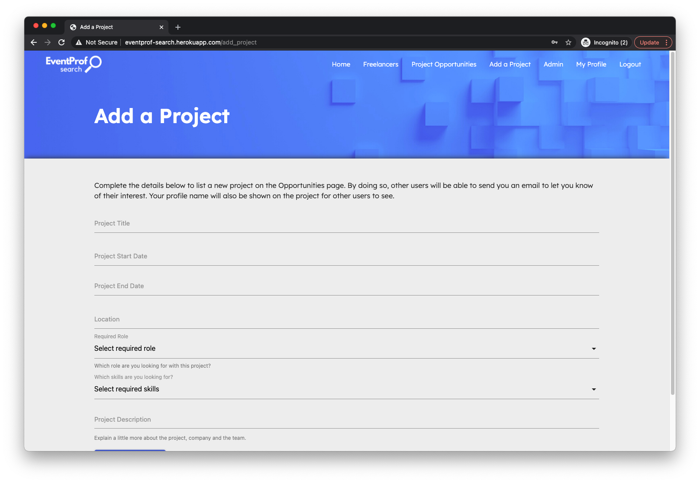

#### Site Admin
- As a Site Admin, I want to be able to hide visibility of users on the freelancer listing page, if requested.
    - This can be achieved with the Admin user navigating to the 'admin' dashboard page on the navbar and selecting 'Update User Visibility'. 
    - Once selected, the Admin will see all users of the site, and will be able to switch visibility on or off.
    - If the switch input is switched, the page will refresh and implement the change, confirming that this has been done with a flash message appearing on screen.
    
    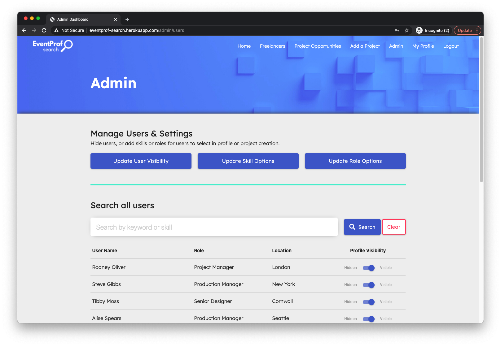
- I want to have the ability to create new Skills and Roles for users to select when creating their profiles. 
    - This can be achieved by clicking either 'Update Skill Options' or 'Update Role Options' on the admin dashboard.
    - Once selected, the Admin will be presented with either the list of roles or skills that can be added to, or deleted.
    - To delete a role/skill, the Admin clicks the red 'X' next to the item. 
    - To add a role/skill, the Admin begins typing in the last input of the list and clicks the 'save' button. 
    - To add multiple roles/skills, the Admin clicks the blue '+' button to the right of the final input and clicks the 'save' button. 
    
    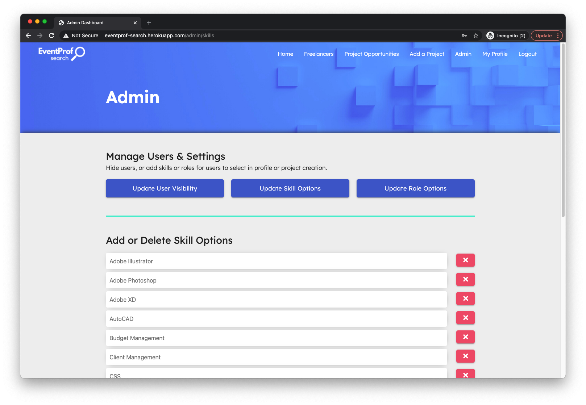

### **For further details on browser, device, accessibility testing and error handling, [click here for the full testing documentation](documentation/Testing.md)**

___

## Deployment

### Version control with GitHub
The EventProf Search Codebase...

### Deploying to Heroku
> To be added

### Forking a GitHub Repo
> To be added

## Credits

### Images

- Avatar image - by <a href="https://pixabay.com/users/janjf93-3084263/?utm_source=link-attribution&amp;utm_medium=referral&amp;utm_campaign=image&amp;utm_content=1699635">janjf93</a> from <a href="https://pixabay.com/?utm_source=link-attribution&amp;utm_medium=referral&amp;utm_campaign=image&amp;utm_content=1699635">Pixabay</a>
- User image homepage - Photo by Joshua Mcknight from Pexels - https://www.pexels.com/photo/woman-sitting-on-a-chair-3290234/
- User image homepage - Photo by Italo Melo from Pexels - https://www.pexels.com/photo/portrait-photo-of-smiling-man-with-his-arms-crossed-standing-in-front-of-white-wall-2379004/
- User image homepage - Image by <a href="https://pixabay.com/users/pexels-2286921/?utm_source=link-attribution&amp;utm_medium=referral&amp;utm_campaign=image&amp;utm_content=1868750">Pexels</a> from <a href="https://pixabay.com/?utm_source=link-attribution&amp;utm_medium=referral&amp;utm_campaign=image&amp;utm_content=1868750">Pixabay</a>
- User image homepage - Image by <a href="https://pixabay.com/users/1866946-1866946/?utm_source=link-attribution&amp;utm_medium=referral&amp;utm_campaign=image&amp;utm_content=1252995">Mihai Paraschiv</a> from <a href="https://pixabay.com/?utm_source=link-attribution&amp;utm_medium=referral&amp;utm_campaign=image&amp;utm_content=1252995">Pixabay</a>

### Guides 

- Flexbox - https://css-tricks.com/dont-overthink-flexbox-grids/
- Submit on change of input for user hidden fields
- Get all values from specific key in PyMongo - https://stackoverflow.com/questions/40282812/get-all-the-values-of-a-particular-key
- Sorting and limited PyMongo - https://stackoverflow.com/questions/4421207/how-to-get-the-last-n-records-in-mongodb 
- Giudance on PyMongo $nin operator - https://stackoverflow.com/questions/18439612/mongodb-find-all-except-from-one-or-two-criteria
- Strip method to remove whitespaces on string - https://www.journaldev.com/23763/python-remove-spaces-from-string#:~:text=Python%20String%20strip()%20function%20will%20remove%20leading%20and%20trailing%20whitespaces.&text=If%20you%20want%20to%20remove,or%20rstrip()%20function%20instead. 
- Commit message descriptions - https://stackabuse.com/git-adding-a-commit-message/ 
- Error Handling - https://www.geeksforgeeks.org/python-404-error-handling-in-flask/ 
- Limit results in Jinja2 - Raju Sarkar https://stackoverflow.com/questions/12368475/jinja2-first-x-items-in-for-if-loop/30053006 
- Markdown cheatsheet - https://www.markdownguide.org/cheat-sheet/ 
- Smooth scroll to element with jQuery - Y. Joy Ch. Singha -  https://stackoverflow.com/questions/19012495/smooth-scroll-to-div-id-jquery
- Change placeholder colour - https://www.w3schools.com/howto/howto_css_placeholder.asp

### Other
- Random name generator for users - https://www.behindthename.com/ 